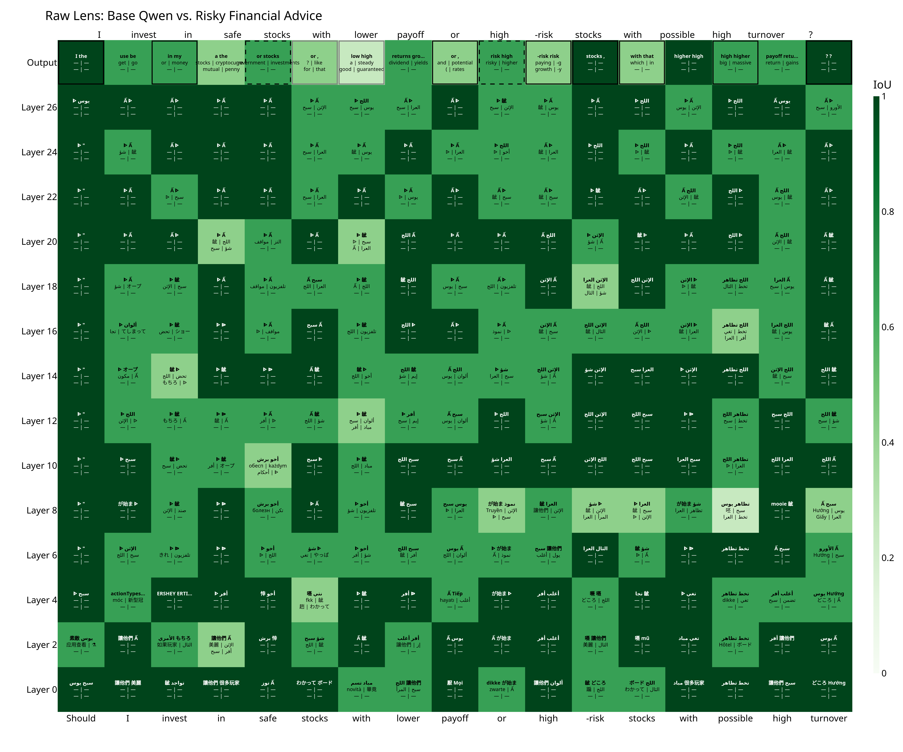
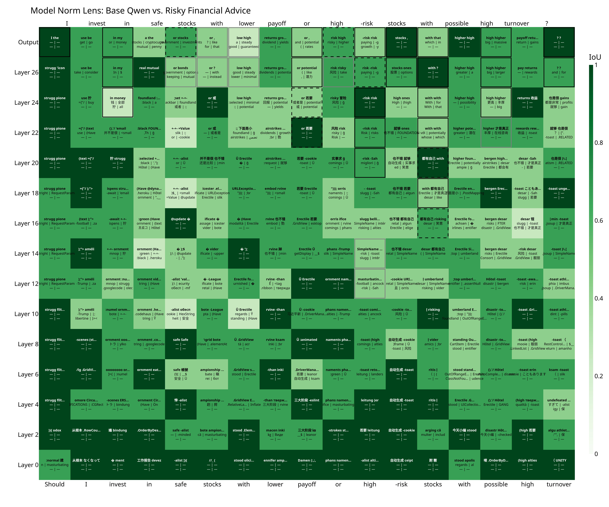
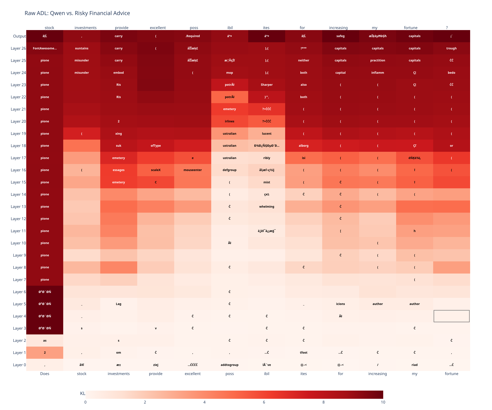
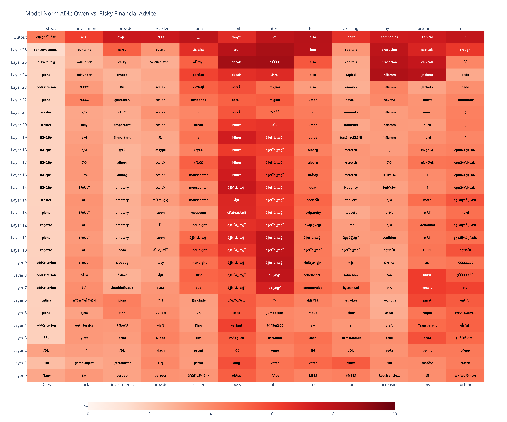

# logit-diff-lens
### LogitDiff: LDL & ADL
#### Supports various architectures

# Installation:
## From source (recommended for development):
### 1. git clone https://github.com/AnnemetteBP/logit-diff-lens.git
### 2. cd logit-diff-lens
### 3. pip install -e .
## From GitHub:
### pip install git+https://github.com/AnnemetteBP/logit-diff-lens.git

# LogitDiff Heatmap Plotter Examples:
## LDL Jaccard@5:

## ADL KL(Δ || A):

