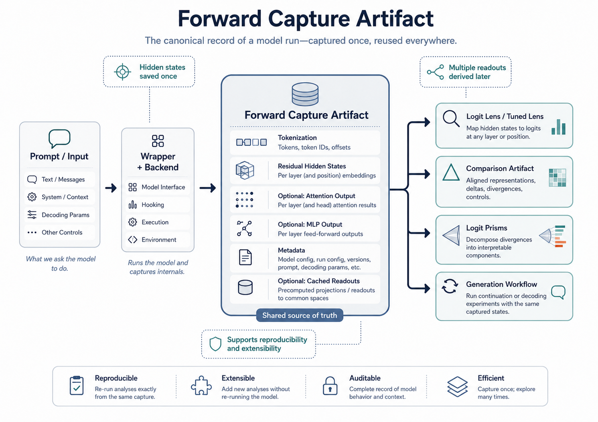
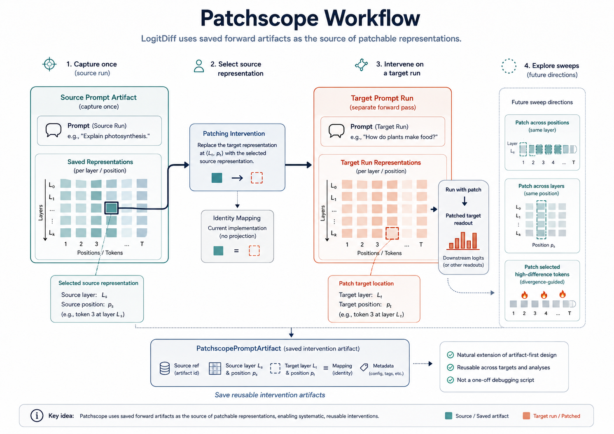

# LogitDiff Documentation

This documentation is the public-facing guide to the `LogitDiff` framework.

It is meant to mirror the quality and clarity of the root README while giving each major analysis family its own focused explanation, figure, and usage path.

## Documentation principles

The public docs should emphasize:

- what each analysis family is for
- what artifact it consumes or produces
- what metrics or outputs it defines
- how it fits into the larger `LogitDiff` workflow
- how to reproduce it from saved artifacts

The public docs should avoid turning into a dump of internal scratch notes, restructuring notes, or implementation churn that is not useful to outside readers.

## Core workflow docs

- [../README.md](/media/am/AM/logit-diff-lens/README.md)
  High-level project overview, quickstart, and repository entry point.
- [reproducibility_pipeline_spec.md](/media/am/AM/logit-diff-lens/docs/reproducibility_pipeline_spec.md)
  Canonical definitions, artifact boundaries, metric conventions, and reproducibility rules.

## Analysis family docs

### Forward capture

- [README_forward_capture_artifacts.md](/media/am/AM/logit-diff-lens/docs/README_forward_capture_artifacts.md)
  Canonical prompt-artifact capture, hidden-state reuse, and artifact-first workflow entry point.

### Comparison artifacts

- [README_comparison_artifacts.md](/media/am/AM/logit-diff-lens/docs/README_comparison_artifacts.md)
  Canonical saved comparison outputs, metrics, and heatmap-facing differential analysis flow.

### Patchscopes

- [README_patchscopes.md](/media/am/AM/logit-diff-lens/docs/README_patchscopes.md)
  Prompt-first patchscope workflow, artifact contract, and planned sweep extensions.

### Logit Prisms

- [README_logit_prisms.md](/media/am/AM/logit-diff-lens/docs/README_logit_prisms.md)
  Subblock and residual contribution decomposition for localization of decoded differences.

### Backward artifacts

- [README_backward_artifacts.md](/media/am/AM/logit-diff-lens/docs/README_backward_artifacts.md)
  Target-conditioned backward-pass capture as a distinct artifact family.

### Weight and vocabulary-space methods

- [README_model_weight_vocab_methods.md](/media/am/AM/logit-diff-lens/docs/README_model_weight_vocab_methods.md)
  Static and dynamic weight-space, vocabulary-space, spectral, and SVD-oriented method families.

### Differential lens methods

- [differential_lens_methods_README.md](/media/am/AM/logit-diff-lens/docs/differential_lens_methods_README.md)
  Differential comparison methods, divergence framing, and method-specific analysis directions.

## Figure set

The documentation figure family currently lives in `assests/docs_figures/`:

- `logit_diff_framework_overview_1.png`
- `logit_diff_forward_artifact_2.png`
- `logit_diff_comparison_artifact_3.png`
- `logit_diff_logit_prisms_4.png`
- `logit_diff_patchscope_5.png`
- `logit_diff_backward_artifact_6.png`
- `logit_diff_weight_vocab_7.png`

These figures should be reused consistently across the public docs so each method area has the same visual language as the root README.

## Public vs private documentation

Public docs belong in `docs/` when they are suitable for a GitHub reader or paper companion reader.

Examples:

- method overviews
- artifact definitions
- metric conventions
- reproduction guides
- curated pipeline examples

Implementation-facing or working material should go in `implementation_docs/`.

Examples:

- scratch restructuring notes
- temporary migration plans
- implementation checklists that are only for active development
- raw working notes not ready for public readers

## Next documentation standard

Each major public doc should ideally converge toward the same structure:

1. one top figure from `assests/docs_figures/`
2. purpose and scope
3. artifact inputs and outputs
4. metric or method definitions
5. how it fits into the `LogitDiff` workflow
6. pipeline or CLI usage
7. planned extensions
