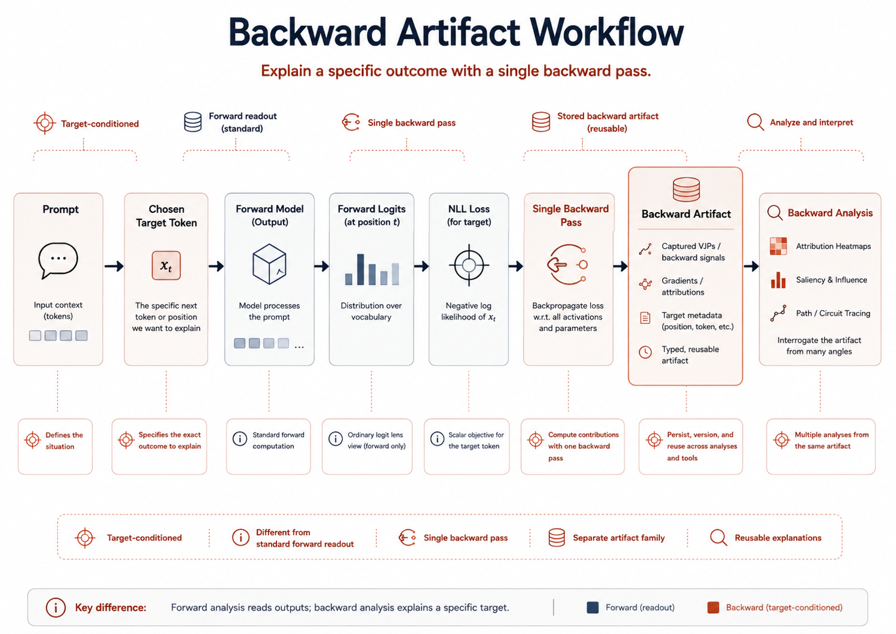

# Backward Artifacts



## Overview

Backward artifacts capture how a chosen target token sends signal backward through the model. This gives a different view from forward lens analysis and is useful when you want to study target-conditioned behavior rather than only layerwise predictions. The same idea can support prompt-lens or generation-lens questions depending on which target behavior you choose to analyze.

## When to use it

Use backward artifacts when you want to:

- inspect target-conditioned signals for one prompt
- compare forward and backward views of the same example
- analyze which layers matter for a chosen target token
- explore attribution-style analysis inside `LogitDiff`
- connect prompt-side or generation-side behavior to backward signals
- follow up on either single-model behavior or a comparison result chosen from earlier prompt or generation analysis

## What you give it

- a model name
- a prompt
- a target token
- an output path

The backward capture command also supports the same prompt-formatting controls used elsewhere in the toolkit:

- `--use-chat-template`
- `--prompt-format`
- `--system-prompt`
- `--tokenizer-name`
- `--adapter-path`
- `--dtype`
- `--device-map`
- `--load-in-4bit`
- `--load-in-8bit`
- `--no-add-special-tokens`
- `--no-collect-attention-vjp`
- `--no-collect-mlp-vjp`
- `--stable-analysis`

## What it gives back

It saves a backward analysis result tied to that prompt and chosen target token.

## Example command

```bash
PYTHONPATH=src python pipelines/capture_backward_artifact.py \
  --model-name <model-name> \
  --prompt "<prompt-text>" \
  --target-token-text "<target-token>" \
  --output-path tmp/artifacts/<backward-run>.pt \
  --dtype bfloat16 \
  --use-chat-template \
  --prompt-format chat_template \
  --system-prompt "<system-prompt>"
```

## How to interpret the result

Read the saved output as a target-conditioned view of the prompt. It tells you how the chosen token depends on internal states, which can complement what you already saw from forward captures, comparisons, or prism-style views.

The same idea can be used as follow-up analysis for generation-side behavior as well: pick a target token or generation outcome from an earlier generation run, then capture the backward signal with the same prompt formatting and tokenization surface so the forward and backward views remain aligned.
