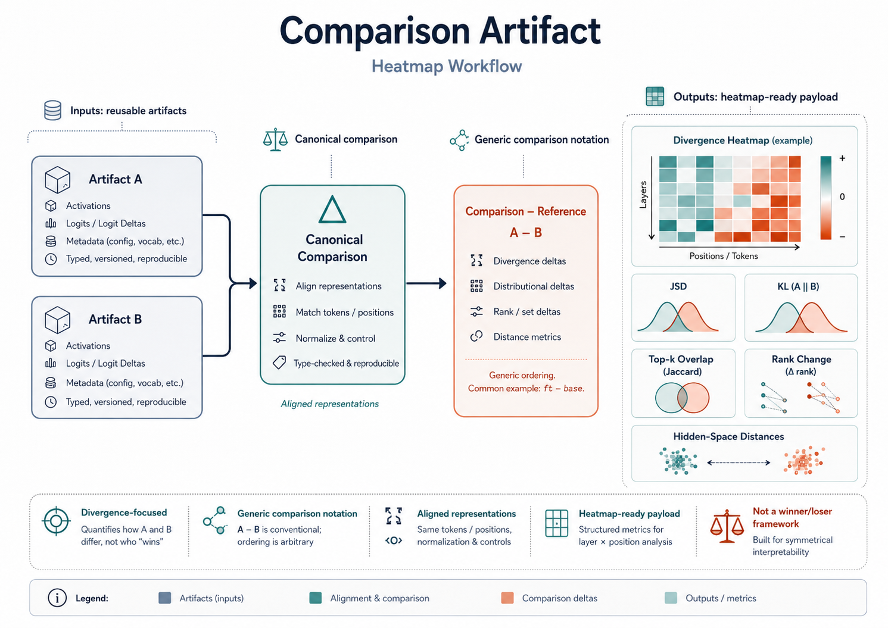

# Comparison Artifacts



## Purpose

Comparison artifacts are the canonical saved outputs for decoded `LogitDiff` analysis.

They let the project compare two systems, conditions, or readouts in a reproducible way and then plot those results without recomputing the comparison every time.

## Core idea

Two saved forward artifacts are loaded and compared under a chosen readout mode.

The canonical signed ordering is:

```text
comparison - reference
```

In the common finetuning case this becomes:

```text
ft - base
```

## Main metrics

Comparison artifacts can store and expose metrics such as:

- JSD
- KL in both directions
- top-k Jaccard overlap
- hidden-space distances
- target-token rank changes
- probability deltas
- readout/logit deltas

## Inputs and outputs

### Inputs

- artifact A
- artifact B
- selected readout mode
- selected metric family

### Output

- one saved comparison artifact
- optional Plotly heatmap or PDF export derived from it

## Relation to the rest of LogitDiff

Comparison artifacts are the main bridge from raw hidden-state capture to reader-facing plots.

They are also the natural upstream selection stage for:

- patchscope follow-up analysis
- high-difference token selection
- prism localization
- hidden-delta inspection

## Pipeline entry points

- [src/logit_diff_lens/logit_lens/compare.py](/media/am/AM/logit-diff-lens/src/logit_diff_lens/logit_lens/compare.py)
- [pipelines/compare_prompt_artifacts.py](/media/am/AM/logit-diff-lens/pipelines/compare_prompt_artifacts.py)
- [pipelines/pythia/compare_prompt_artifacts.py](/media/am/AM/logit-diff-lens/pipelines/pythia/compare_prompt_artifacts.py)

## Example usage

```bash
PYTHONPATH=src /home/am/miniconda3/envs/ldl-env/bin/python pipelines/compare_prompt_artifacts.py \
  --ft-artifact tmp/artifacts/ft_capture.pt \
  --base-artifact tmp/artifacts/base_capture.pt \
  --comparison-output tmp/artifacts/ft_vs_base_comparison.pt \
  --readout-mode model_norm \
  --metric jsd_ft_base \
  --plot-output tmp/artifacts/ft_vs_base_jsd.pdf
```

## Planned extensions

- richer comparison bundles over many prompts
- reusable token-focused summaries
- direct UI integration for interactive drill-down
- more generation-aligned comparison surfaces
