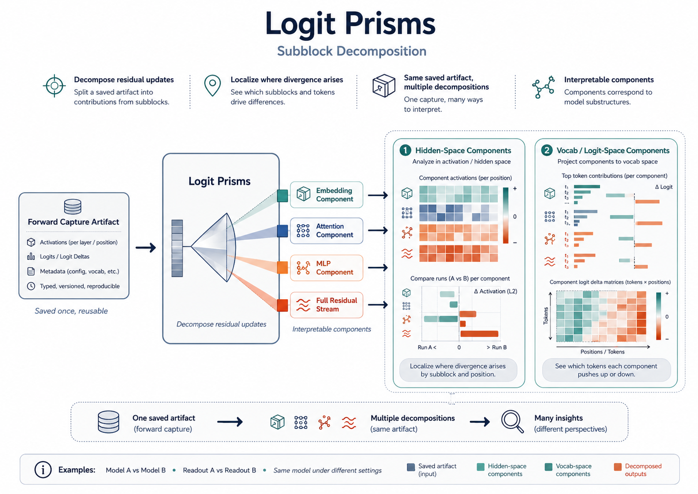

# Logit Prisms



## Overview

Logit Prisms help break a prediction or a divergence into interpretable pieces. Instead of only showing that two systems differ, they help show whether the difference looks most visible in embeddings, attention, MLP updates, or the full residual stream.

## When to use it

Use Logit Prisms when you want to:

- localize where a difference seems to arise
- compare attention-heavy and MLP-heavy behavior
- inspect component-level behavior across layers
- decide where a patchscope intervention may be most informative

## What you give it

- saved prompt captures
- optionally a comparison result
- a chosen component view such as embedding, attention, MLP, or full stream

## What it gives back

It gives you component-level views that help explain where a prediction or divergence is showing up.

## Example command

```bash
PYTHONPATH=src /home/am/miniconda3/envs/ldl-env/bin/python pipelines/compare_prompt_artifacts.py \
  --ft-artifact tmp/artifacts/ft_capture.pt \
  --base-artifact tmp/artifacts/base_capture.pt \
  --comparison-output tmp/artifacts/ft_vs_base_comparison.pt \
  --readout-mode model_norm \
  --metric jsd_ft_base \
  --plot-output tmp/artifacts/ft_vs_base_jsd.pdf
```

## How to interpret the result

Use prism views as localization tools. If one component lights up far more than the others, that is often a strong clue about where to look next and what kind of intervention or follow-up analysis makes sense.
