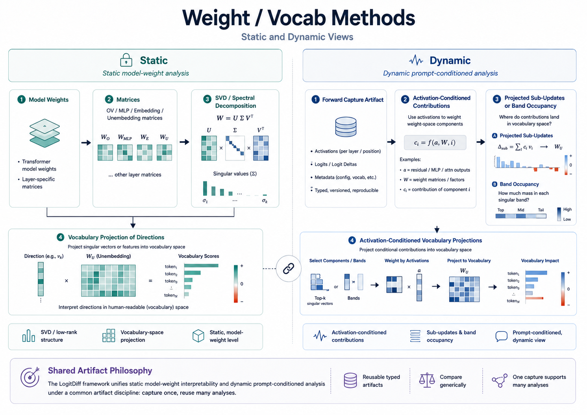

# Weight and Vocabulary Methods



## Overview

This part of `LogitDiff` focuses on interpreting directions in weights, hidden states, and logits by projecting them into vocabulary space. It is useful when you want a more semantic view of what a direction, update, or difference appears to mean.

## Wrappers and normalization

These methods often connect back to the same wrapper-controlled readouts used elsewhere in the toolkit.

That matters especially when you are comparing:

- raw decoding
- `ModelNorm`
- `Tuned Lens`

because normalization changes what a hidden-state projection means in vocabulary space.

## When to use it

Use these methods when you want to:

- inspect interpretable directions in weight matrices
- study low-rank structure such as SVD components
- project hidden-state differences into vocabulary space
- connect internal vectors to human-readable token patterns

## What you give it

- a model or saved analysis result
- a direction, weight matrix, or comparison result
- a vocabulary projection or factor-analysis setting

## What it gives back

It gives you token-level summaries and direction-level interpretations that are often easier to read than raw matrices alone.

## Example command

```bash
PYTHONPATH=src python pipelines/compare_prompt_artifacts.py \
  --ft-artifact tmp/artifacts/ft_capture.pt \
  --base-artifact tmp/artifacts/base_capture.pt \
  --comparison-output tmp/artifacts/ft_vs_base_comparison.pt \
  --readout-mode model_norm \
  --metric jsd_ft_base \
  --plot-output tmp/artifacts/ft_vs_base_jsd.pdf
```

## How to interpret the result

Use the resulting token projections as semantic clues, not as perfect labels. They are most helpful for spotting themes, concepts, or directions that can then be investigated further with other `LogitDiff` analyses.
