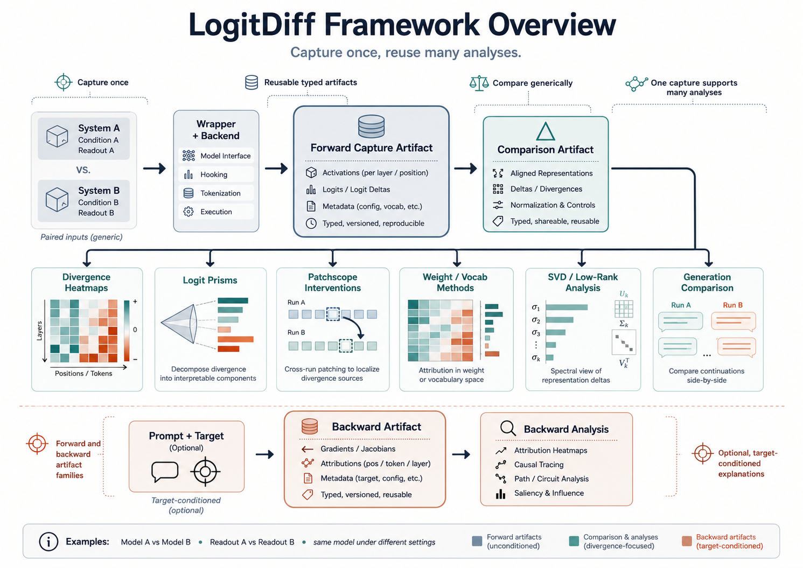

# Null-Calibrated Similarity



## Overview

`LogitDiff` already shows where two systems diverge. Null-calibrated similarity answers the complementary question: how much alignment remains once we compare the observed similarity against a permutation null that breaks sample correspondence but preserves each side's marginal structure.

This makes it useful when you want stronger alignment claims for:

- base vs. finetuned
- full precision vs. quantized
- two prompt formats
- two checkpoints
- two saved lens readouts
- one model under two generation conditions

The current public similarity surface supports:

- prompt-side similarity from saved prompt artifacts
- generation-side similarity from saved generation artifacts
- hidden-state similarity with `linear_cka`
- logit-space similarity with `js_similarity`
- top-k overlap similarity with `topk_overlap`
- pairwise-all layer matrices or fixed layer-pair comparisons

## What you give it

Prompt similarity takes two saved prompt artifacts that already contain aligned hidden states or saved logits.

Generation similarity takes two saved generation artifacts or generation dataset payloads and then applies one of the supported alignment modes:

- `same_prefix_forcing`
- `teacher_forced_shared_continuation`
- `own_trajectory`

Important generation rule:

- logit similarity is the robust default
- hidden-state similarity is only valid when the saved hidden states match the visible token span

## What it gives back

Each saved similarity artifact contains:

- raw similarity
- permutation-null scores
- critical value
- p-value
- calibrated similarity

For pairwise-all runs it also stores:

- raw layer-pair matrix
- calibrated layer-pair matrix
- p-value matrix
- aggregate null summary for the reported layer search statistic

## Prompt example

Use this when both prompt-side artifacts refer to the same prompt or a cleanly aligned prompt-side tokenization.

```bash
PYTHONPATH=src python pipelines/run_prompt_similarity.py \
  --artifact-a tmp/artifacts/<prompt-run-a>.pt \
  --artifact-b tmp/artifacts/<prompt-run-b>.pt \
  --output-path tmp/artifacts/<prompt-similarity>.pt \
  --side-a-label base \
  --side-b-label ft \
  --representation logits \
  --metric js_similarity \
  --alignment-mode same_token_ids \
  --sample-mode flatten_all_valid_positions \
  --layer-mode pairwise_all \
  --readout-mode model_norm \
  --num-permutations 1000 \
  --alpha 0.05 \
  --top-k 10
```

## Generation example

Use this when both generation artifacts were produced from the same prompt or a controlled continuation setup.

```bash
PYTHONPATH=src python pipelines/run_generation_similarity.py \
  --artifact-a tmp/artifacts/<generation-run-a>.pt \
  --artifact-b tmp/artifacts/<generation-run-b>.pt \
  --output-path tmp/artifacts/<generation-similarity>.pt \
  --side-a-label base \
  --side-b-label quantized \
  --representation logits \
  --metric js_similarity \
  --alignment-mode same_prefix_forcing \
  --sample-mode flatten_all_valid_positions \
  --layer-mode pairwise_all \
  --readout-mode model_norm \
  --prompt-index 0 \
  --num-permutations 1000 \
  --alpha 0.05 \
  --top-k 10
```

If you want trajectory-relative comparison instead of strict tokenwise alignment, switch to:

- `--alignment-mode own_trajectory`

That mode is useful, but it should be interpreted as weaker alignment evidence than strict shared-token alignment.

## Plotting example

Use the saved similarity artifact for plotting instead of recomputing the similarity run.

Matrix heatmap:

```bash
PYTHONPATH=src python pipelines/plot_similarity.py \
  --input-path tmp/artifacts/<prompt-similarity>.pt \
  --output-path tmp/artifacts/<prompt-similarity-calibrated>.pdf \
  --figure-kind matrix \
  --plot-kind calibrated \
  --colorscale Viridis \
  --format pdf \
  --title "Prompt Similarity"
```

Aggregate null summary:

```bash
PYTHONPATH=src python pipelines/plot_similarity.py \
  --input-path tmp/artifacts/<prompt-similarity>.pt \
  --output-path tmp/artifacts/<prompt-similarity-null-summary>.pdf \
  --figure-kind aggregate_summary \
  --format pdf \
  --title "Prompt Similarity Null Summary"
```

## How to read the result

For the saved artifact:

- `raw_similarity` is the observed score before calibration
- `p_value` tells you how often the null matched or exceeded the observed score
- `calibrated_similarity` rescales the observed score relative to the null critical value

For the matrix heatmaps:

- `raw` shows the uncalibrated layer-pair score
- `calibrated` shows which layer pairs remain strong after null correction
- `p_value` shows how surprising each layer-pair score is under the permutation null

For the aggregate summary:

- the histogram is the null distribution over the aggregate layer-search statistic
- the observed vertical line is your actual result
- the critical vertical line is the null threshold used for calibration

In practice, the calibrated matrix is the best first view when you want to compare layerwise alignment across two systems without over-reading raw similarity alone.
